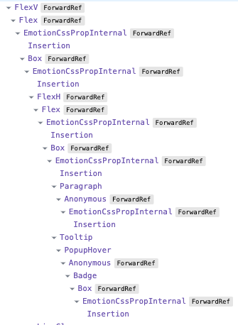
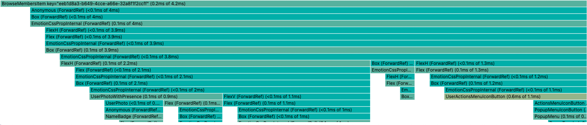
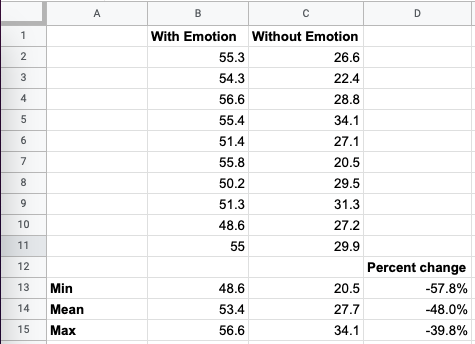

# Why We're Breaking Up with CSS-in-JS

Hi, I'm Sam — software engineer at [Spot](https://www.spotvirtual.com/) and the 2nd most active maintainer of [Emotion](https://emotion.sh/), a widely-popular CSS-in-JS library for React. This post will delve into what originally attracted me to CSS-in-JS, and why I (along with the rest of the Spot team) have decided to shift away from it.

We'll start with an overview of CSS-in-JS and give an overview of its pros & cons. Then, we'll do a deep dive into the performance issues that CSS-in-JS caused at Spot and how you can avoid them.

## What is CSS-in-JS?

As the name suggests, CSS-in-JS allows you to style your React components by writing CSS directly in your JavaScript or TypeScript code:

```tsx
// @emotion/react (css prop), with object styles
function ErrorMessage({ children }) {
  return (
    <div
      css={{
        color: 'red',
        fontWeight: 'bold',
      }}
    >
      {children}
    </div>
  );
}

// styled-components or @emotion/styled, with string styles
const ErrorMessage = styled.div`
  color: red;
  font-weight: bold;
`;
```

[styled-components](https://styled-components.com/) and [Emotion](https://emotion.sh/) are the most popular CSS-in-JS libraries in the React community. While I have only used Emotion, I believe virtually all points in this article apply to styled-components as well.

This article focuses on **runtime CSS-in-JS**, a category which includes both styled-components and Emotion. Runtime CSS-in-JS simply means that the library interprets and applies your styles when the application runs. We'll briefly discuss compile-time CSS-in-JS at the end of the article.

## The Good, The Bad, and the Ugly of CSS-in-JS

Before we get into the nitty-gritty of specific CSS-in-JS coding patterns and their implications for performance, let's start with a high-level overview of why you might choose to adopt the technology, and why you might not.

### The Good

1. **Locally-scoped styles.** When writing plain CSS, it's very easy to accidentally apply styles more widely than you intended. For example, imagine you're making a list view where each row should have some padding and a border. You'd likely write CSS like this:

   ```css
   .row {
     padding: 0.5rem;
     border: 1px solid #ddd;
   }
   ```

   Several months later when you've completely forgotten about the list view, you create another component that has rows. Naturally, you set `className="row"` on these elements. Now the new component's rows have an unsightly border and you have no idea why! While this type of problem can be solved by using longer class names or more specific selectors, it's still on you as the developer to ensure there are no class name conflicts.

   CSS-in-JS completely solves this problem by making styles locally-scoped by default. If you were to write your list view row as

   ```tsx
   <div css={{ padding: '0.5rem', border: '1px solid #ddd' }}>...</div>
   ```

   there is no way the padding and border can accidentally get applied to unrelated elements.

   > Note: CSS Modules also provide locally-scoped styles.

2. **Colocation.** If using plain CSS, you might put all of your `.css` files in a `src/styles` directory, while all of your React components live in `src/components`. As the size of the application grows, it quickly becomes difficult to tell which styles are used by each component. Often times, you will end up with dead code in your CSS because there's no easy way to tell that the styles aren't being used.

   A better approach for organizing your code is to **include everything related to a single component in same place.** This practice, called colocation, has been covered in an [excellent blog post](https://kentcdodds.com/blog/colocation) by Kent C. Dodds.

   The problem is that it's hard to implement colocation when using plain CSS, since CSS and JavaScript have to go in separate files, and your styles will apply globally regardless of where the `.css` file is located. On the other hand, if you're using CSS-in-JS, you can write your styles directly inside the React component that uses them! If done correctly, this greatly improves the maintainability of your application.

   > Note: CSS Modules also allow you to colocate styles with components, though not in the same file.

3. **You can use JavaScript variables in styles.** CSS-in-JS enables you to reference JavaScript variables in your style rules, e.g.:

   ```tsx
   // colors.ts
   export const colors = {
     primary: '#0d6efd',
     border: '#ddd',
     /* ... */
   };

   // MyComponent.tsx
   function MyComponent({ fontSize }) {
     return (
       <p
         css={{
           color: colors.primary,
           fontSize,
           border: `1px solid ${colors.border}`,
         }}
       >
         ...
       </p>
     );
   }
   ```

   As this example shows, you can use both JavaScript constants (e.g. `colors`) and React props / state (e.g. `fontSize`) in CSS-in-JS styles. The ability to use JavaScript constants in styles reduces duplication in some cases, since the same constant does not have to be defined as both a CSS variable and a JavaScript constant. The ability to use props & state allows you to create components with highly-customizable styles, without using inline styles. (Inline styles are not ideal for performance when the same styles are applied to many elements.)

### The Neutral

1. **It's the hot new technology.** Many web developers, myself included, are quick to adopt the hottest new trends in the JavaScript community. Part of this is rationale, since in many cases, new libraries and frameworks have proven to be massive improvements over their predecessors (just think about how much React enhances productivity over earlier libraries like jQuery). On the other hand, the other part of our obsession with shiny new tools is just that — an obsession. We're afraid of missing out on the next big thing, and we might overlook real drawbacks when deciding to adopt a new library or framework. I think this has certainly been a factor in the widespread adoption of CSS-in-JS — at least it was for me.

### The Bad

1. **CSS-in-JS adds runtime overhead.** When your components render, the CSS-in-JS library must "serialize" your styles into plain CSS that can be inserted into the document. It's clear that this takes up extra CPU cycles, but is it enough to have a noticeable impact on the performance of your application? **We'll investigate this question in depth in the next section.**

2. **CSS-in-JS increases your bundle size.** This is an obvious one — each user who visits your site now has to download the JavaScript for the CSS-in-JS library. Emotion is [7.9 kB](https://bundlephobia.com/package/@emotion/react@11.10.4) minzipped and styled-components is [12.7 kB](https://bundlephobia.com/package/styled-components@5.3.6). So neither library is huge, but it all adds up. (`react` + `react-dom` is 44.5 kB for comparison.)

3. **CSS-in-JS clutters the React DevTools.** For each element that uses the `css` prop, Emotion will render `<EmotionCssPropInternal>` and `<Insertion>` components. If you are using the `css` prop on many elements, Emotion's internal components can really clutter up the React DevTools, as seen here:



### The Ugly

1. **Frequently inserting CSS rules forces the browser to do a lot of extra work.** [  
   Sebastian Markbåge](https://github.com/sebmarkbage), member of the React core team and the original designer of React Hooks, wrote an [extremely informative discussion](https://github.com/reactwg/react-18/discussions/110) in the React 18 working group about how CSS-in-JS libraries would need to change to work with React 18, and about the future of runtime CSS-in-JS in general. In particular, he says:

   > In concurrent rendering, React can yield to the browser between renders. If you insert a new rule in a component, then React yields, the browser then have to see if those rules would apply to the existing tree. So it recalculates the style rules. Then React renders the next component, and then that component discovers a new rule and it happens again.
   >
   > **This effectively causes a recalculation of all CSS rules against all DOM nodes every frame while React is rendering.** This is VERY slow.

   The worst thing about this problem is that it's not a fixable issue (within the context of runtime CSS-in-JS). Runtime CSS-in-JS libraries work by inserting new style rules when components render, and this is bad for performance on a fundamental level.

2. **With CSS-in-JS, there's a lot more that can go wrong, especially when using SSR and/or component libraries.** In the Emotion GitHub repository, we receive _tons_ of issues that go like this:

   > I'm using Emotion with server-side rendering and MUI/Mantine/(another Emotion-powered component library) and it's not working because...

   While the root cause varies from issue to issue, there are some common themes:

   - Multiple instances of Emotion get loaded at once. This can cause problems even if the multiple instances are all the same version of Emotion. [(Example issue)] (https://github.com/emotion-js/emotion/issues/2639)
   - Component libraries often do not give you full control over the order in which styles are inserted. [(Example issue)](https://github.com/emotion-js/emotion/ issues/2803)
   - Emotion's SSR support works differently between React 17 and React 18. This was necessary for compatibility with React 18's streaming SSR. [(Example issue)] (https://github.com/emotion-js/emotion/issues/2725)

   And believe me, these sources of complexity are just the tip of the iceberg. (If you're feeling brave, take a look at the [TypeScript definitions for `@emotion/styled`](https://github.com/emotion-js/emotion/blob/8a163746f0de5c6a43052db37f14c36d703be7b9/packages/styled/types/base.d.ts).)

## Performance Deep Dive

At this point, it's clear that there are both significant pros and significant cons to runtime CSS-in-JS. To understand why our team is moving away from the technology, we need to explore the real-world performance impact of CSS-in-JS.

This section focuses on the performance impact of Emotion, **as it was used in the Spot codebase.** As such, it would be a mistake to assume that the performance numbers presented below apply to your codebase as well — there are many ways to use Emotion, and each of these has its own performance characteristics.

### Serialization Inside of Render vs. Outside of Render

_Style serialization_ refers to the process by which Emotion takes your CSS string or object styles and converts them to a plain CSS string that can be inserted into the document. Emotion also computes a hash of the plain CSS during serialization — this hash is what you see in the generated class names, e.g. `css-15nl2r3`.

While I have not measured this, I believe one of the most significant factors in how Emotion performs is whether style serialization is performed inside or outside of the React render cycle.

The examples in the Emotion docs perform serialization inside render, like this:

```tsx
function MyComponent() {
  return (
    <div
      css={{
        backgroundColor: 'blue',
        width: 100,
        height: 100,
      }}
    />
  );
}
```

Every time `MyComponent` renders, the object styles are serialized again. If `MyComponent` renders frequently (e.g. on every keystroke), the repeated serialization may have a high performance cost.

A more performant approach is to move the styles outside of the component, so that serialization happens one time when the module loads, instead of on each render. You can do this with the `css` function from `@emotion/react`:

```tsx
const myCss = css({
  backgroundColor: 'blue',
  width: 100,
  height: 100,
});

function MyComponent() {
  return <div css={myCss} />;
}
```

Of course, this prevents you from accessing props in your styles, so you are missing out on one of the main selling points of CSS-in-JS.

**At Spot, we performed style serialization in render, so the following performance analysis will focus on this case.**

### Benchmarking the Member Browser

It's finally time to make things concrete by profiling a real component from Spot. We'll be using the Member Browser, a fairly simple list view that shows you all of the users in your team. Virtually all of the Member Browser's styles are using Emotion, specifically the `css` prop.


For the test,

- The Member Browser will display 20 users,
- The `React.memo` around the list items will be removed, and
- We'll force the top-most `<BrowseMembers>` component to render each second, and record the times for the first 10 renders.
- React Strict Mode is off. (It effectively doubles the render times you see in the profiler.)

I profiled the page using the React DevTools and got **54.3 ms** as the average of the first 10 render times.

My personal rule of thumb is that a React component should take 16 ms or less to render, since 1 frame at 60 frames per second is 16.67 ms. The Member Browser is currently over 3 times this figure, so it's a pretty heavyweight component.

This test was performed on an **M1 Max** CPU which is WAY faster than what the average user will have. The 54.3 ms render time that I got could easily be **200 ms** on a less powerful machine.

### Analyzing the Flamegraph

Here's the flamegraph for a **single list item** from the above test:



As you can see, there are a huge number of `<Box>` and `<Flex>` components being rendered — these are our "style primitives" which use the `css` prop. While each `<Box>` only takes 0.1 – 0.2 ms to render, this adds up because the total number of `<Box>` components is massive.

### Benchmarking the Member Browser, without Emotion

To see how much of this expensive render was due to Emotion, I rewrote the Member Browser styles using Sass Modules instead of Emotion. (Sass Modules are compiled to plain CSS at build time, so there is virtually no performance penalty to using them.)

I repeated the same test described above and got **27.7 ms** as the average of the first 10 renders. That's a **48% decrease** from the original time!

So, that's the reason we are breaking up with CSS-in-JS: the runtime performance cost is simply too high.

To repeat my disclaimer from above: this result only directly applies to the Spot codebase and how we were using Emotion. If your codebase is using Emotion in a more performant way (e.g. style serialization outside of render), you will likely see a much smaller benefit after removing CSS-in-JS from the equation.

Here is the raw data for those who are curious:



## Our New Styling System

After we made up our minds to switch away from CSS-in-JS, the obvious question is: what should we be using instead? Ideally, we want a styling system that has performance similar to that of plain CSS while keeping as many of the benefits of CSS-in-JS as possible. Here are the primary benefits of CSS-in-JS that I described in the section titled "The Good":

1. Styles are locally-scoped.
2. Styles are colocated with the components they apply to.
3. You can use JavaScript variables in styles.

If you paid close attention to that section, you'll remember that I said that CSS Modules also provide locally-scoped styles and colocation. And CSS Modules compile to plain CSS files, so there is no runtime performance cost to using them.

The main downside to CSS Modules in my mind is that, at end of the day, they are still plain CSS — and plain CSS is lacking features that improve DX and reduce code duplication. While [nested selectors](https://developer.chrome.com/blog/help-css-nesting/) are coming to CSS, they aren't here yet, and this feature is a huge quality of life boost for us.

Fortunately, there is an easy solution to this problem — Sass Modules, which are simply CSS Modules written in [Sass](https://sass-lang.com/). You get the locally-scoped styles of CSS Modules AND the powerful build-time features of Sass, with essentially no runtime cost. This is why Sass Modules will be our general purpose styling solution going forward.

> Side note: With Sass Modules, you lose benefit 3 of CSS-in-JS (the ability to use JavaScript variables in styles). Though, you can use an `:export` block in your Sass file to make constants from the Sass code available to JavaScript. This isn't as convenient, but it keeps things DRY.

### Utility Classes

One concern the team had about switching from Emotion to Sass Modules is that it would be less convenient to apply extremely common styles, like `display: flex`. Before, we would write:

```tsx
<FlexH alignItems="center">...</FlexH>
```

To do this using only Sass Modules, we would have to open the `.module.scss` file and create a class that applies the styles `display: flex` and `align-items: center`. It's not the end of the world, but it's definitely less convenient.

To improve the DX around this, we decided to bring in a utility class system. If you aren't familiar with utility classes, they are CSS classes that set a single CSS property on the element. Usually, you will combine multiple utility classes to get the desired styles. For the example above, you would write something like this:

```tsx
<div className="d-flex align-items-center">...</div>
```

[Bootstrap](https://getbootstrap.com/) and [Tailwind](https://tailwindcss.com/) are the most popular CSS frameworks that offer utility classes. These libraries have put a lot of design effort into their utility systems, so it made the most sense to adopt one of them instead of rolling our own. I had already been using Bootstrap for years, so we went with Bootstrap. While you can bring in the Bootstrap utility classes as a pre-built CSS file, we needed to customize the classes to fit our existing styling system, so I copied the relevant parts of the Bootstrap source code into our project.

We've been using Sass Modules and utility classes for new components for several weeks now and are quite happy with it. The DX is similar to that of Emotion, and the runtime performance is vastly superior.

> Side note: We're also using the [typed-scss-modules](https://www.npmjs.com/package/typed-scss-modules) package to generate TypeScript definitions for our Sass Modules. Perhaps the largest benefit of this is that it allowed us to define a `utils()` helper function that works like [classnames](https://www.npmjs.com/package/classnames), except it only accepts valid utility class names as arguments.

### A Note about Compile-Time CSS-in-JS

This article focused on runtime CSS-in-JS libraries like Emotion and styled-components. Recently, we've seen an increasing number of CSS-in-JS libraries that convert your styles to plain CSS at compile time. These include:

- [Compiled](https://compiledcssinjs.com/)
- [Vanilla Extract](https://vanilla-extract.style/)
- [Linaria](https://linaria.dev/)

These libraries purport to provide a similar benefits to runtime CSS-in-JS, without the performance cost.

While I have not used any compile-time CSS-in-JS libraries myself, I still think they have drawbacks when compared with Sass Modules. Here are the drawbacks I saw when looking at Compiled in particular:

- Styles are still inserted when a component mounts for the first time, which forces the browser to recalculate the styles on every DOM node. (This drawback was discussed in the section title "The Ugly".)
- Dynamic styles like the `color` prop in [this example](https://compiledcssinjs.com/#speed-up-your-styles) cannot be extracted at build time, so Compiled adds the value as a CSS variable using the `style` prop (a.k.a. inline styles). Inline styles are known to cause suboptimal performance when applied many elements.
- The library still inserts boilerplate components into your React tree as shown [here](https://compiledcssinjs.com/#speed-up-your-styles). This will clutter up the React DevTools just like runtime CSS-in-JS.

## Conclusion

Thanks for reading this deep dive into runtime CSS-in-JS. Like any technology, it has its pros and cons. Ultimately, it's up to you as a developer to evaluate these pros and cons and then make an informed decision about whether the technology is right for your use case. For us at Spot, the runtime performance cost of Emotion far outweighed the DX benefits, especially when you consider that the alternative of Sass Modules + utility classes still has a good DX while providing vastly superior performance.

## About Spot

At [Spot](https://www.spotvirtual.com/), we're building the future of remote work. When companies go remote, they often lose the sense of connection and culture that was present in the office. Spot is a next-gen communication platform that brings your team together by combining traditional messaging and video conferencing features with the ability to create & customize your own 3D virtual office. Please check us out if that sounds interesting!

P.S. We're looking for talented software engineers to join the team! [See here for details.](https://www.spotvirtual.com/careers/)


_This post was also published [on the Spot blog](TODO)._
